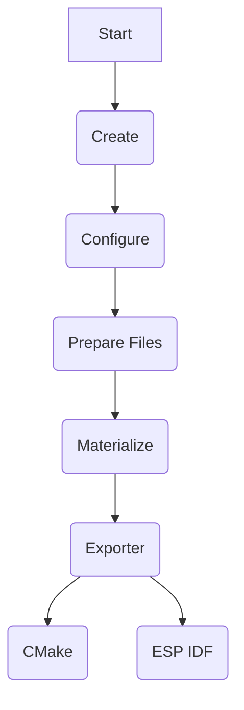

# AGENTS.md - Agent Guidelines for the `lobs` Codebase

## Overview

**lobs** is a Python framework (version 0.0.x, beta) that provides an easy application and library project generator for C++ projects. It generates build configurations for multiple systems (CMake, ESP-IDF) from a single Python source file definition.

- **Repository**: [github.com/rikardonm/lobs](https://github.com/rikardonm/lobs)
- **Package Name**: `py-lobs` on PyPI
- **License**: MIT
- **Python Requirement**: 3.13+
- **Status**: Beta (4 of 5 - development stage)

### Core Philosophy

The framework is heavily inspired by the **Zen of Python**. Key design principles include:

1. **Every library is a package** - Each unit is encapsulated as a `lobs.Package` subclass
2. **Every application is a plain script** - Project definitions are simple Python files
3. **Dependency resolution via pip** - Uses Python's package manager for version handling
4. **One package, one target** - Each package contains exactly one library or application
5. **All files exist on disk** - Executed code must be sourced from files (for editor/linting support)
6. **Everything is monkey-patchable** - Full control and visibility over generated configurations

---

## Quick Start for Agents

### Understanding the Workflow



1. **Create** - Define a `Package` subclass with project entities
2. **Configure** - Set properties, flags, and dependencies
3. **Prepare Files** - Download/extract dependencies via `_prepare_files()`
4. **Materialize** - Convert packages to project structures via `_make_project()`
5. **Export** - Generate build system files (CMake, ESP-IDF)

### Simple Example

```python
import lobs

class MyApplication(lobs.Package):
    app = lobs.cpp.project.SimpleManagedApplication(
        source_files=[lobs.Path(__file__).with_name("main.cpp")],
        compilation_flags={"w_all": True},
    )

# Or via CLI:
# lobs export my-project.py cmake
```

---

## Repository Structure

```
lobs/
├── src/lobs/                    # Main package source
│   ├── core/                   # Core abstractions (Package, Resolver, Exporter)
│   ├── domains/                # Domain-specific extensions (C++, etc.)
│   ├── exporters/              # Build system exporters (CMake, ESP-IDF)
│   └── machinery/              # Utility modules
├── examples/                   # Working examples for common use cases
├── tests/                      # Test suite
├── docs/                       # Sphinx documentation
├── docker/                     # Docker configurations
├── pyproject.toml             # Project metadata & build config
└── README.md                  # User documentation
```

---

## Core Abstractions for Agents

### 1. `Package` Class (`src/lobs/core/package/base.py`)

The central abstraction representing a project unit (library or application).

**Key Methods:**
- `__init_subclass__` - Class-level initialization with metadata
- `_prepare_files(self, basepath: Path)` - Download/extract dependencies
- `_validate_configuration(self)` - Validate package configuration
- `_make_project(self, basepath: Path) -> Project` - Create project entity
- `capture_all_from_module(m: ModuleType)` - Class method to extract single package from module

**Example:**
```python
class MyPackage(lobs.Package, version=lobs.Version(0,1,0)):
    def _prepare_files(self, basepath):
        provider = lobs.providers.DownloadablePackage(url)
        provider.resolve_to(basepath)
    
    def _make_project(self, basepath):
        return lobs.cpp.project.SimpleLibrary(source_files=[...])
```

### 2. `Parameter` Class (`src/lobs/core/package/base.py`)

Generic parameter with requirements validation using `annotated-types`.

**Usage:**
```python
from lobs.core.package import Parameter
from annotated_types import Gt, Lt

class MyPackage(lobs.Package):
    max_size: Parameter[int] = Parameter(default=100)
    
    def _validate_configuration(self):
        if self.max_size.value and self.max_size.value > 1000:
            raise ValueError("max_size too large")
```

### 3. `PackageResolver` (`src/lobs/core/resolver.py`)

Recursively resolves package dependencies and constructs a DAG.

**Key Method:**
```python
root = PackageResolver(MyPackage, target_path).materialize_dag()
```

This:
1. Creates instances of packages with their configuration
2. Recursively resolves dependencies via `_get_dependencies()`
3. Builds a DAG (Directed Acyclic Graph) using `bigtree`
4. Returns root node for export

### 4. `Project` Entities (`src/lobs/domains/cpp/project.py`)

Domain-specific project constructs:

| Class | Description |
|-------|-------------|
| `SimpleLibrary` | Static or interface library |
| `SimpleManagedApplication` | Console/application executable |
| `EmbeddedApplication` | For embedded targets like ESP-IDF |

**Shared Properties:**
- `source_files: list[Path]` - Source code files
- `public_includes`, `private_includes`: Include directories
- `linked_libraries: list[type[Package]]` - Dependency packages
- `compilation_flags: CompilationFlags` - Compiler flags dataclass
- `artifact_name: str | None` - Output name override

### 5. Exporter Pattern (`src/lobs/core/exporter.py`)

Generic exporter base class for build system generation.

**Structure:**
```python
class BaseExporter(GenericExporter[TCFG], abc.ABC):
    @abc.abstractmethod
    def _export_node(self, node: Node, config: TCFG) -> None: ...
    
    def export(self) -> None:
        # Traverse nodes bottom-first, then call _export_node for each
```

---

## Dependency Resolution Process

The framework resolves dependencies through a recursive DAG construction:

1. **Package Instantiation** - `inst = current()` creates package instance
2. **Prepare Files** - `_prepare_files(pkg_tgt)` downloads/extracts deps
3. **Validation** - `_validate_configuration()` ensures validity
4. **Project Creation** - `_make_project(pkg_tgt)` returns Project entity
5. **Dependency Discovery** - Iterates `dir(self)` for `Project` attributes, extracts via `_get_dependencies()`
6. **Recursion** - For each dependency, repeat steps 1-5
7. **Error Handling** - Unresolved dependencies raise `RuntimeError`

### Key Considerations:
- Dependencies are discovered by looking for `Project` instances in package attributes
- Circular dependencies will cause infinite recursion (currently unsupported)
- Each package is resolved to a subdirectory named after its `tag`

---

## Build System Exporters

### CMake Exporter (`src/lobs/exporters/cmake/`)

**Files:**
- `exporter.py` - Main export logic
- `writer.py` - CMake file generation with smart line wrapping
- `syntax.py` - AST node definitions (Project, Executable, Library)

**Key Features:**
- CMake 3.22+ minimum version
- Automatic dependency directory inclusion via `add_subdirectory()`
- Link libraries from dependencies
- Custom compilation flags handling (`w_*` prefix → `-W*`)

### ESP-IDF Exporter (`src/lobs/exporters/esp_idf/`)

**Files:**
- `exporter.py` - ESP-IDF export logic
- `sdkconfig.py` - Configuration file generation
- `nvs.py` - NVS partition handling (present but minimal)

**Key Features:**
- Supports `EXTRA_COMPONENT_DIRS` for dependent components
- Generates `sdkconfig.defaults` from configuration flags
- Component directory structure matching ESP-IDF requirements

---

## CLI Interface

Command-line tool implemented with Click:

```bash
# Materialize the project (no output, just prepare)
lobs materialize my-project.py [--resolve-to PATH]

# Visualize dependency graph as PNG
lobs visualize my-project.py [--resolve-to PATH]

# Export to build system
lobs export my-project.py cmake   # or espidf
```

**Package Discovery:**
The CLI automatically finds package files using this priority:
1. `__init__.py`
2. `package.py`
3. `<directory-name>.py`

---

## Testing Patterns

### Test Structure (`tests/test_export_cmake.py`)

```python
# Pattern 1: Direct API usage
def test_export_library(test_file, ref_dot):
    target_file = examples_dir.joinpath(*test_file)
    with tempfile.TemporaryDirectory() as _tmpdir:
        tmpdir = Path(_tmpdir)
        
        # Load package class
        package_klass = Package.capture_all_from_module(
            import_module('project_module', target_file)
        )
        
        # Resolve dependencies
        resolver = PackageResolver(package_klass, output_path)
        root = resolver.materialize_dag()
        
        # Verify DAG
        assert dag_dot.to_string() == ref_dot
        
        # Export
        exp = CMakeExporter(root, output_path)
        exp.export()
```

**Test Coverage:**
- `test_export_cmake.py` - CMake exporter functionality
- `test_version.py` - Version string parsing (SemVer, pep440-style)

### CLI Test Pattern

```python
result = subprocess.run(
    [sys.executable, "-m", "lobs", "export", str(target_file), 
     "--resolve-to", str(output_path), "cmake"],
    capture_output=True, text=True
)
assert result.returncode == 0, result.stdout + result.stderr
```

---

## Version Handling

**Location**: `src/lobs/core/version.py`

```python
version = lobs.Version(1, 2, 3, extra="rc1")  # -> "1.2.3-rc1"
Version.parse("v1.2.3-alpha")  # Returns Version object
```

**Supported Formats:**
- SemVer: `1.2.3`, `1.2.3-beta`
- vPrefixed: `v1.2.3`
- Quasi-PEP440 (via parsing flexibility)

---

## Important Implementation Details

### Monkey-Patchability Design

The codebase is designed to be extensively monkey-patchable:
- Attributes can be modified at runtime: `app.compilation_flags.w_all = True`
- Dictionary-style access: `app.compilation_flags["w_extra"] = True`
- Custom flags: `app.compilation_flags["w_comment"] = True` (dynamically adds)

### File-Based Execution Requirement

All project files **must** be saved to disk before execution. The framework uses the file path for:
- Resolving source file locations
- Creating relative paths in generated Build configuration
- Module import system via `import_module()`

### Package Tag Uniqueness

Package tags must be unique across all loaded packages:
```python
# Each class registers itself via __init_subclass__
lobs.Package.__known_tags__[cls.tag] = cls  # RuntimeError if duplicate
```

---

## Common Use Cases for Agents

### Creating a New Library Package

```python
import lobs
from pathlib import Path

class MyLib(lobs.Package, version=lobs.Version(0,1,0)):
    lib = lobs.cpp.project.SimpleLibrary(
        source_files=[Path(__file__).parent / "src" / "mylib.cpp"],
        public_includes=[Path(__file__).parent / "include"],
        artifact_name="mylib",
    )
```

### Creating an Application with Dependencies

```python
import lobs
from pathlib import Path

class MyApp(lobs.Package, description="My cool app"):
    # External dependencies can use providers
    nlohmann = lobs.providers.DownloadablePackage(
        "https://github.com/nlohmann/json/releases/download/v3.12.0/json.tar.xz"
    )
    
    app = lobs.cpp.project.SimpleManagedApplication(
        source_files=[Path(__file__).parent / "main.cpp"],
        linked_libraries=[MyLib],  # Internal dependency
    )
```

### Custom Exporter Configuration

```python
@dataclasses.dataclass
class MyExporterConfig(lobs.exporter.ExporterConfiguration):
    custom_flag: str = ""
    
class MyExporter(lobs.exporter.GenericExporter[MyExporterConfig]):
    config_type = MyExporterConfig
    
    def _export_node(self, node, config):
        # Access via self._config.custom_flag or node package export config
        pass
```

---

## Documentation References

- **Main Docs**: [docs/](./docs/) - Sphinx-generated documentation
- **Architecture**: `docs/architecture.rst` - Detailed design decisions
- **Extensions**: `docs/extensions.rst` - How to add new exporters/domains
- **Examples**: `docs/examples.rst` - Complete working examples

---

## Build & Development Commands

```bash
# Install in editable mode
python -m pip install -e ".[dev]"

# Run tests
pytest -v

# Type checking (mypy)
hatch run types:check

# Generate docs
cd docs && make html

# Build distributable
python -m build

# CLI development
python -m lobs export examples/cmake-single-app/cmake-single-app.py cmake --resolve-to /tmp/test
```

Docker support for CI builds available at `docker/base-cmake-gcc.Dockerfile`.

---

## Known Limitations & Considerations

1. **No Circular Dependencies** - The DAG resolution assumes acyclic dependencies
2. **Single Python File per Package** - Packages must be defined in a single `__init__.py` or `.py` file
3. **Python 3.13+ Only** - Type hints and syntax require modern Python
4. **C++ Specific** - Currently only C++ domain is implemented (CPP-specific project types)
5. **No Build System for This Project** - Uses `hatchling` exclusively

---

## Extending lobs

### Adding a New Domain

1. Create new directory under `src/lobs/domains/`
2. Define project/entity classes inheriting from `Project`
3. Add to `__all__` export list

### Adding a New Exporter

1. Create new directory under `src/lobs/exporters/`
2. Implement class inheriting from `GenericExporter[TCFG]`
3. Define `_export_node(self, node, config)` abstract method
4. Register via package tag in CLI (`__main__.py`)

### Adding a New Package Provider

1. Create class under `src/lobs/core/package/providers.py`
2. Implement `resolve_to(target: Path)` method
3. Use in `_prepare_files(self, basepath)` of your package

---

## Agent Workflow Recommendations

When helping users work with this codebase:

1. **Understand the goal** - What build system? Which dependencies?
2. **Locate relevant examples** - Check `examples/` directory first
3. **Follow the Package pattern** - Define subclass of `lobs.Package`
4. **Use Project entities** - Choose appropriate project class (SimpleLibrary, etc.)
5. **Handle exports via CLI or code** - Use `PackageResolver → Exporter` pattern
6. **Debug dependency issues** - Check `_get_dependencies()` methods and tags

### Common Issues & Solutions

| Issue | Likely Cause | Solution |
|-------|--------------|----------|
| "Could not find package" | Wrong filename in CLI | Use `<name>.py`, `package.py`, or `__init__.py` |
| "No project found in the package" | No Project attribute found | Define `app = ...Project(...)` as class/module attribute |
| Version parsing fails | Non-SemVer format | Wrap version with proper format (e.g., `Version.parse("1.2.3")`) |
| Circular dependency error | Cycle in linked_libraries | Refactor dependencies, avoid cycle |
| "No exporter configuration found" | Missing `export` attribute | Add appropriate config or extend exporter config class |

---

## Code Style & Conventions

- **EditorConfig**: 4-space indentation, LF line endings, UTF-8
- **Black**: Line length 120, py312 target
- **Flake8**: Max line length 120
- **Type Checking**: Pyright strict mode with `pyright: reportUnusedImport = false` to allow imports
- **Documentation**: ReStructuredText for Sphinx docs, standard docstrings

---

*This AGENTS.md file was generated to help AI agents understand and work effectively with the lobs codebase. Last updated based on repository analysis from November 2025.*
